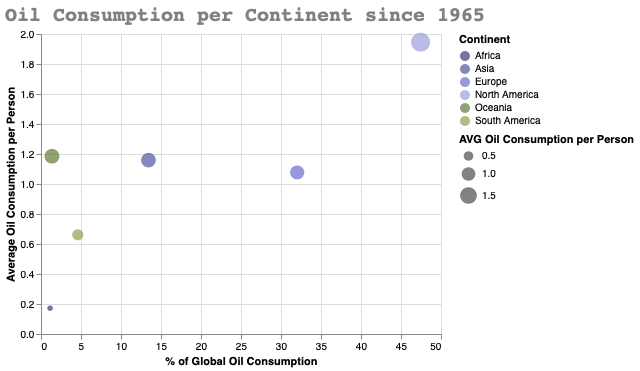

# Visual Analytics for Data Science
## Visualizations of Energy Statistics

## Hypothesis:
- The global oilconsumption is increasing year by year since 1965.
- Asia has already a higher oil consumption than North America.
- Europe has the highest percentage of Hydro Power in their energymix.
- Asia is the continent with the highest Electricity Generation.
- The energyconsumption of Asia and Africa are both increasing.
- The coal consumption is decreasing in Europe and North America.

## Data:

For my Data Visualisations I have used Altair and the Energy Datasets from Gapminder and the Internation Energy Agency.
- https://www.gapminder.org/data/
- https://www.iea.org/data-and-statistics/

You can find the rawdata in the directory data/raw/ . 
With the scrips in the directory src/ I have cleaned, aggregated and prepared the raw datasets and saved them in data/ .

## Data Preparation:

After downloading the raw data, it was necessary to clean the data, because in the gapminder datasets were many missing values. For a few plots there was also additional data necessary, which was added from the IEA-Datasets. Then the data was aggregated to get continental data and then I had to create roworiented datasets for further working with altair.

The final preparation of the data, for the use with altair, happened in the notebooks/main-data-preparation.pynb file. The datasets for creating the altair charts were saved into data/melted_data/  and can be used directly with altair.

## Here a few examples of my visualizations:

# Here you can find more data visualisations:

  [Data Visualisation Notebook](https://github.com/RetoHe/visual-analytics-energy-data/blob/main/notebooks/Energy-Data-Visualizations.ipynb)
